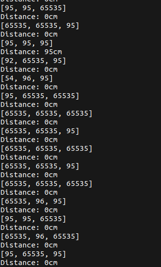
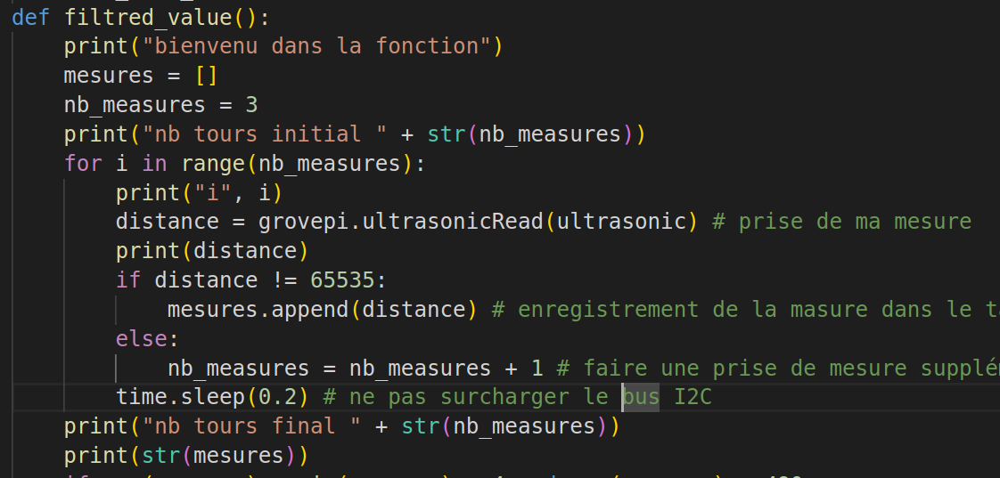
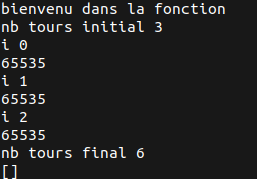

# Dans cette nouvelle version (v2)
*Optimiser le programme, nouveau fonctionnement, simplification des communications avec le serveur MQTT*

Remarque: Pour chaque Raspberry, nous copions ce programme et nous modifions le code pour les informations suivantes correspondes aux capteurs:
- Identifiant de connexion au serveur MQTT: CaptU1, CaptU2, CaptU3
- Le champ id du message MQTT: capteur1, capteur2, capteur3

Serveur: 192.168.102.250
Raspberry1 (capteur1): 192.168.102.247
Raspberry2 (capteur2): 192.168.102.248
Raspberry3 (capteur3): 192.168.102.249

-> le script est lancé automatiquement par le systeme au démarrage grace à crontab:
crontab -e
"
@reboot sleep 10 && python3 /home/pi/Dexter/GrovePi/Software/Python/main.py
"

# Installation dependance en +
pip3 install paho-mqtt
pip3 install typing_extensions

# Utilisation
1. Allumer le serveur MQTT et le rendre disponible sur le réseau
2. Allimenter les Raspberry (lancement automatique du programme)
Remarque: Si le serveur MQTT s'arrete en cours de route ou n'est pas disponible lors du lancement du programme, alors le programme s'arretera

## Informations globales et objectifs du programme
- Récupérations des mesures de distances toutes les 200 millisecondes
- Filtrer les mesures pour n'avoir que les vraies mesures (pas 496, 497, 65535...)
- envoyer l'information de présence d'obstacle (0 ou 1) à un serveur MQTT uniquement en cas de changement d'état
- utilisation d'une LED pour informer si en phase d'initialisation (allumé) ou si il y a un obstacle
--> un obstacle doit etre placé avant de lancer le programme, pour fixer un seuil de détection <--
!! Si le programme n'arrive pas à se connecter au serveur MQTT alors le programme s'arrete !!

## Fonctionnement détaillé
0. Initialisation du programme, des fonctions et des dépendances
    Fonction mqtt_connect:
        Allumer la LED
        Tanter de se connecter au serveur MQTT, avec les identificants de connexions
        Boucler tant que la connexion n'est pas initialisée (code erreur different de 0)
        Si code d'erreur = 0 alors connecté, sortir de la boucle et éteindre la LED
    Fonction mqtt_push:
        - tester d'envoyer le message sur le serveur: le message est récupéré en parametre
            + mettre la variable de last_mqtt_msg à valeur de message
        - si probleme (code erreur different de 0) alors lancer la fonction mqtt_connect
    Fonction filtred_value:
        Objectif: Filtrer les erreurs de mesures
        - Prendre 3 mesures à la suite
        - mesures l'écart entre les 3 mesures: si elles sont à plus de 4 unités de différence alors fausse valeur, donc ne rien remonter (0)+allumer LED, sinon remonter la valeur moyenne entière+eteindre la LED. De plus, la mesure doit <490
    

1. Connexion au serveur MQTT
    Executer la fonction mqtt_connect

2. Déterminer la valeur du seuil à partir duquel sera detecté un obstacle
    - Executer la fonction filtred_value et si valeur < 10 alors boucler, sinon enregistrer la valeur-5 comme seuil

3. envoyer 0 sur le serveur MQTT (pas obstacle)

4. Lecture des mesures
    - récuperer la valeur de filtred_value et la stocker dans une variable
    - si la valeur et plus petite que seuil et est different de 0 & last_mqtt_msg contient data !=1 alors nouvelle obstacle: executer fonction mqtt_push de la valeur 1 + Allumer la LED
        sinon si last_mqtt_msg contient data !=0: (plus d'obstacle) executer fonction mqtt_push de la valeur 0 + Eteindre la LED

# Résolution de problèmes

Trop d'erreurs de mesures sont renvoyés, ce qui faire que la fonction de filtrage r'envoie toujours 0 (affichage Distance: 0cm).
Pour parrer ce problème, une nouvelles mesures sera prise dès que la valeur 65535 est détectée.

solution: boucle while

# Amélioration
- Faire que le programme boucle, au lieu de s'arreter, lorsque le serveur MQTT n'est plus disponible